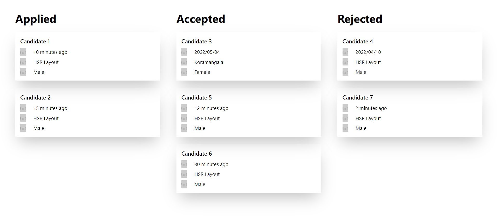

## Features

-   View a list Candidates Applied, Accepted and Rejected

## Installation

1. Clone the repository:

    ```bash
    git clone https://github.com/Paraschawla21/workindia.git
    cd client
    ```

2. install dependencies:

    ```bash
    npm install
    ```

3. Start the development server:

    ```bash
    npm start
    ```

4. Open your browser and visit http://localhost:3000 to view the app.

## Technologies Used

1. React
2. Axios for API requests
3. TailWind CSS

## Website Look


